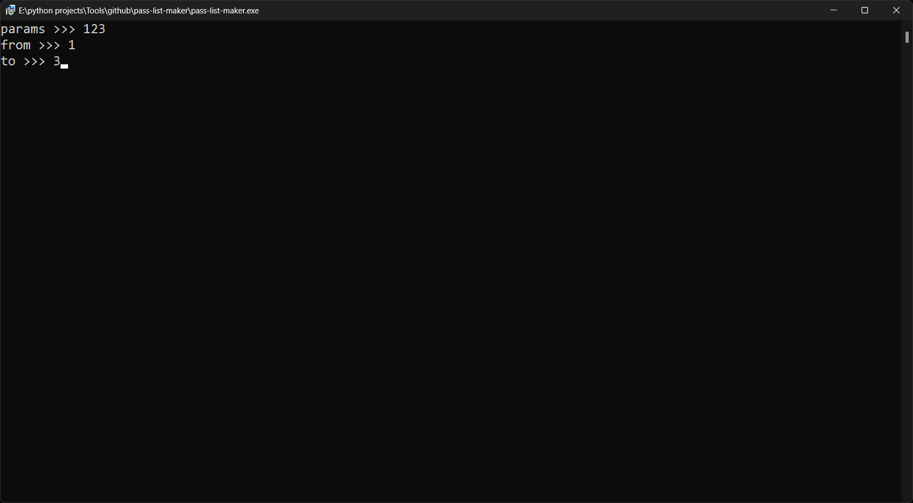
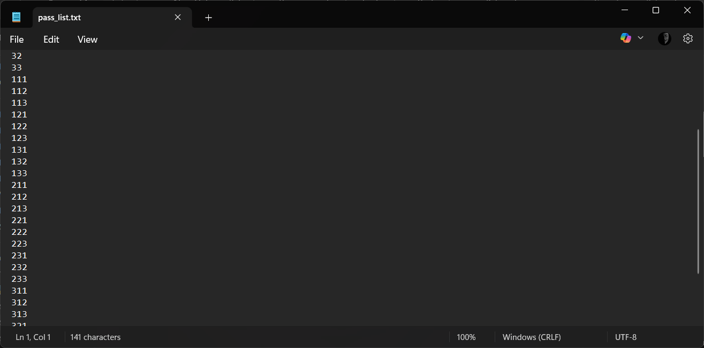

# [pass-list-maker](https://github.com/Sina2468/pass-list-maker) .   

A pass-list generator written in Python and runs in the terminal 

## Installation

1. Download the program

        git clone https://github.com/Sina2468/pass-list-maker.git

* or 

    https://github.com/Sina2468/pass-list-maker/archive/refs/heads/main.zip

## Usage

1. run **pass-list-maker.exe**

    * params = anything you want to be in your pass-list
    * from = minimum password length
    * to = maximum password length

2. Inter to make **pass-list.txt**

## License

[MIT licensed](./LICENSE)
